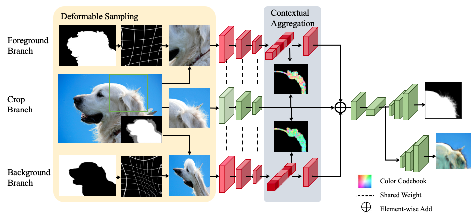

# Natural Image Matting with Attended Global Context

<p align="center">
  
</p>


[[paper]](https://jcst.ict.ac.cn/EN/10.1007/s11390-022-1690-z) [[supplementary]](Supplemantary.pdf)

## Introduction
we introduce a natural image matting with attended global context method to extract global contextual information from the whole image, and to condense them into suitable size for learning-based network. Specifically, we first leverage a deformable sampling layer to obtain condensed foreground and background attended images respectively. Then, we utilize a contextual attention layer to extract information related to unknown region from condensed foreground and background images generated by a deformable sampling layer. Besides, our network predicts a background as well as the alpha matte to obtain more purified foreground, which contributes to better qualitative performance in composition.

## Dependencies
#### Packages:
- torch >= 1.1
- tensorboardX
- numpy
- opencv-python
- toml
- easydict
- pprint

## Evaluation

To evaluate our natural image matting with attened global context method, run:
```
python tester.py --image-dir <YOUR_RGB_DIR_TOSUBJECT> \
                --trimap-dir <YOUR_TRIMAP_DIR_TOSUBJECT> \
                --output <YOUR_OUTPUT_DIR> \
                --checkpoint ./checkpoints/best_model.pth 
```
